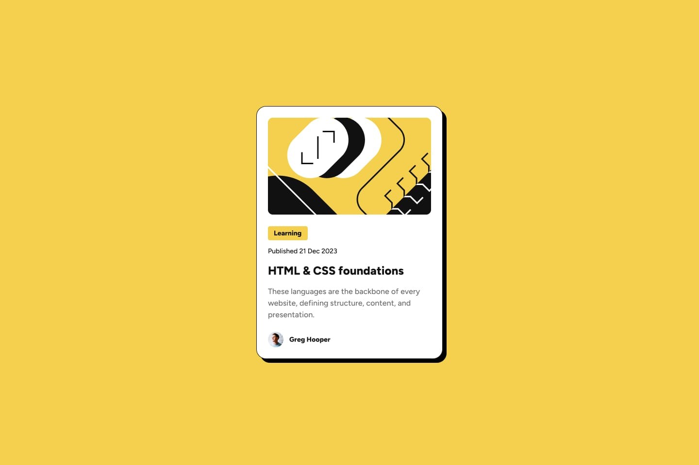
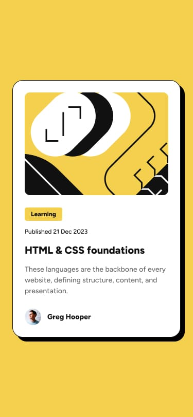

# Frontend Mentor - Blog Preview Card Solution

This is my solution to the Blog Preview Card challenge on Frontend Mentor. Frontend Mentor challenges help improve coding skills by building realistic projects.

## The Challenge

Users should be able to:

- See hover and focus states for all interactive elements on the page

#### Screenshot

#### **Desktop View**

#### **Mobile View**

---

## Links

*Solution URL**: [GitHub Repository](https://github.com/nabi0l/)
- Live Site URL: [Add live site URL here]

## My Process

- Built with:
  - Semantic HTML5 markup
  - CSS custom properties
  - Flexbox
  - Mobile-first workflow

## What I Learned

This project helped me strengthen my understanding of Flexbox and CSS custom properties.

I also experimented with creating reusable components

## Continued Development

In the future, I aim to:

- Improve my responsiveness techniques for various devices.
- Learn more about optimizing CSS for maintainability and scalability.
- Explore additional modern tools like CSS Grid or utility-first frameworks.
